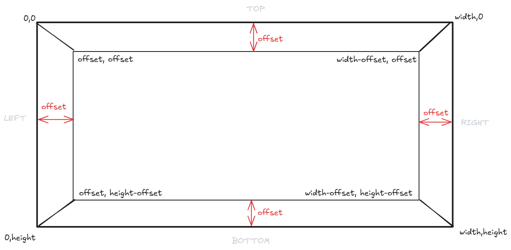
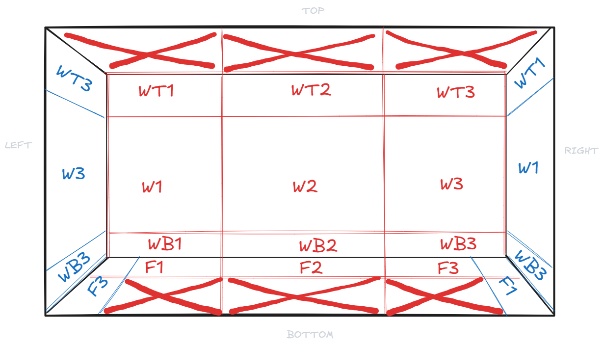
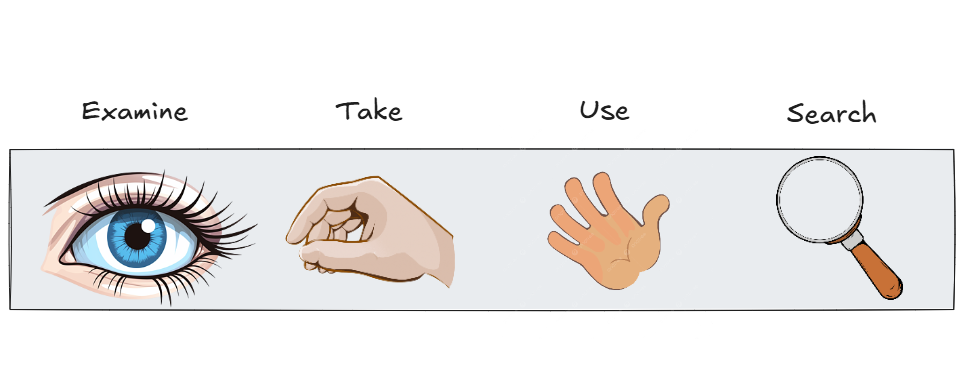
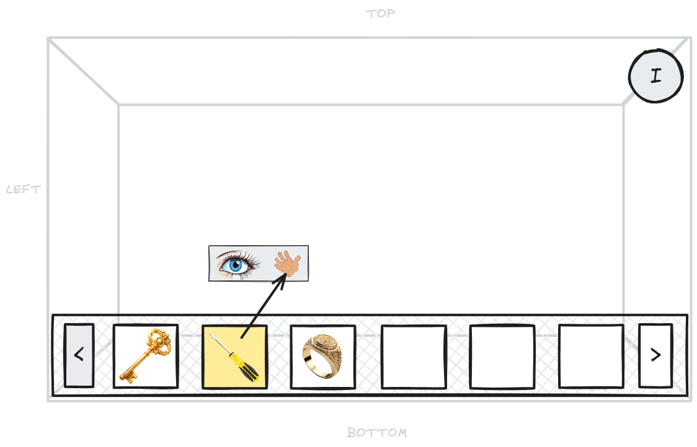
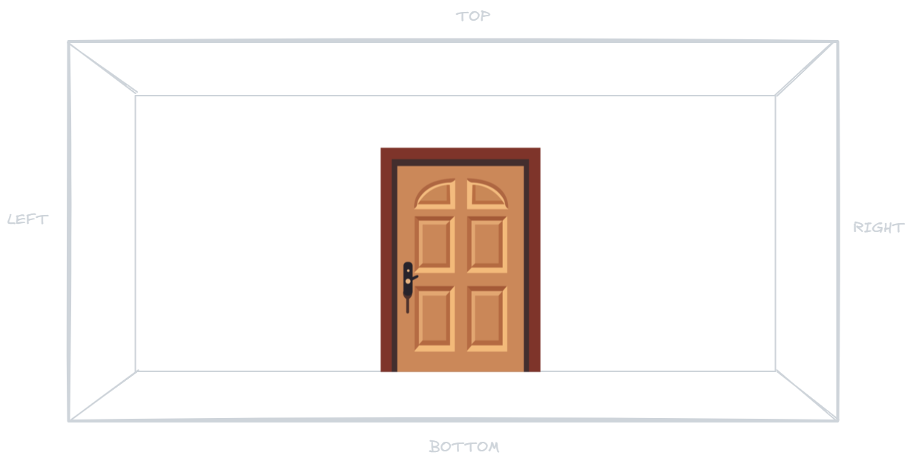
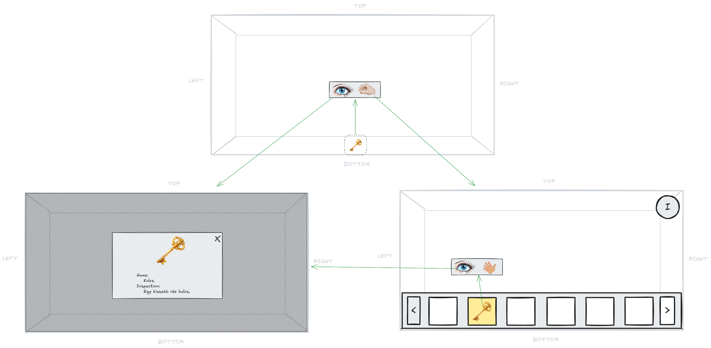
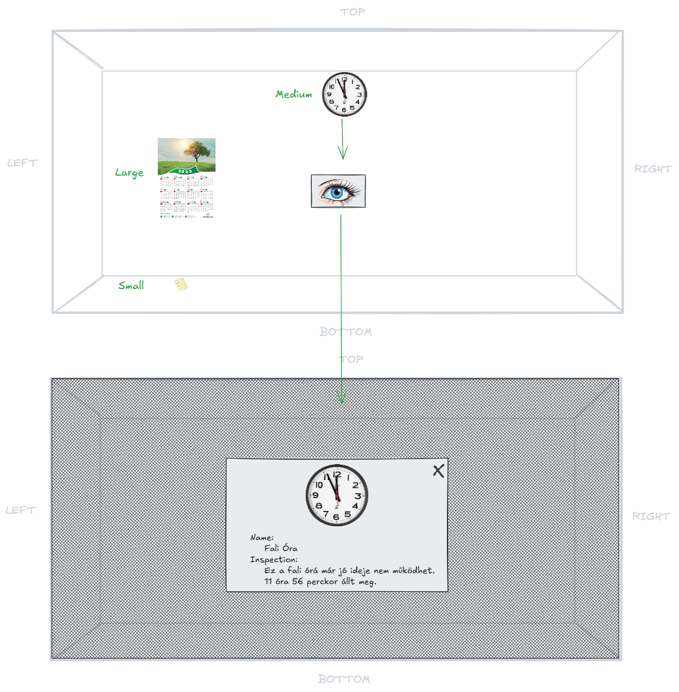
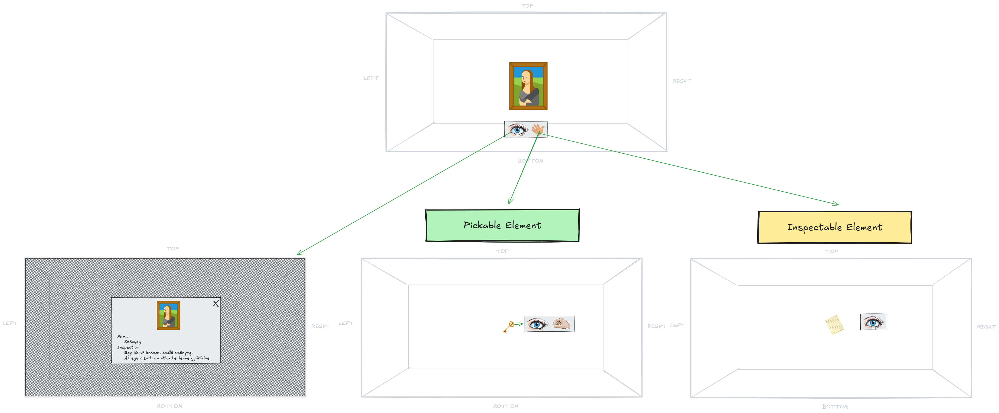

# ------------------UI-------------------

# ---------PÁLYA KIRAJZOLÁSA----------
Játékos egy szabályos szögletes szoba közepén helyezkedik el.  
Játékosnak mindig a vele szemben lévő falra van teljes rálátása.  
Perspektívának megfelelően, kirajzolásra kerül a jobb és baloldalon látható fal is, de csak annak megfelelő szakaszai.  
A játékos távolságát a tekintett faltól egy konstans perspektív érték adja meg.

Egy fal 3x3-as szakaszra van felosztva.  
Felső, középső és alsó. Ezen felül ez a 3 terület még 3 részre van osztva. Bal, közép és jobb.
A Padlóra is lehetőség van játék elemet rajzolni, azonban adat struktúrát tekintve ez szintén a fal részét képezi.  

- **Felső szakasz**
    - WT1
    - WT2
    - WT3

- **Középső szakasz**
    - W1
    - W2
    - W3

- **Alsó szakasz**
    - WB1
    - WB2
    - WB3

- **Padló**
    - F1
    - F2
    - F3

### Cursor Mechanismus
A játékban legfeljebb 4 alapvető akció érhető el egy tárgy interaktálása során

| Akció             | Leírás 
|-------------------|-------------------------------------------
| **Megvizsgál.**   | Ezzel az akcióval csak megvizsgálni tudja a játékos az adott játék elemet. 
| **Eltesz**        | Ezzel az akcióval lehet [Felvehető](#pickable) játék elemeket felvenni.
| **Használ**       | Ezzel az akcióval lehet interakcióba lépni játék elemekkel valamint inventory-ból elemet kiválasztani. Sikeres interakció előtt szükséges lehet megfelelő tárgy kiválasztása inventory-ból szintén ezzel az akcióval
| **Átkutat**       | Ezzel az akcióval lehet [Konténer](#container) objektumokat átkutatni.

### Inventory Mechanismus
A képernyő jobb felső sarkában van egy gomb, amivel fel lehet nyitni és le lehet zárni az inventory-t.  
Játék során felvett játék elemek itt kerülnek eltárolásra.  
Több felvett játék elem esetén, az inventory lapozható.

# ---------------GAME OBJECTS---------------
## Wall

A **Wall** egy szoba falát reprezentálja a játékban.  
Tartalmazhat kijáratot, felvehető tárgyakat és interakciós elemeket.

| Property          | Típus                                 | Leírás 
|-------------------|---------------------------------------|---------------------------------------------------------
| **Id**            | `Guid`                                | Egyedi azonosító minden falhoz.
| **Color**         | `string`                              | A fal színe (pl. `#ffaa00` vagy `"red"`).
| **Exit**          | `null` \| [Exit](#exit)               | A falon található kijárat objektum, ha létezik.
| **Pickables**     | array\<[Pickable](#pickable)>         | Felvehető tárgyak listája.
| **Inspectables**  | array\<[Inspectable](#inspectable)>   | Megvizsgálható elemek (pl. festmények, táblák).
| **Containers** | array\<[Container](#container)> | Interakcióra alkalmas objektumok (pl. kapcsolók, gombok).
| **MovableCovers** | array\<[MovableCover](#movablecover)> | Interakcióra alkalmas objektumok (pl. kapcsolók, gombok).

## Exit
A **Exit** objektum a falon található kijáratot írja le.  
Pályán csak egyetlen egy ilyen elem található  

| Property      | Típus                         | Leírás                            
|---------------|-------------------------------|-----------------------------------
| **Lock**      | [Lock](#lock)                 | Kijárat zár leírása  
| **Sprite**    | [SpriteSet](#spriteset)       | A kijárat vizuális megjelenése.   

**_Activator_**  
- Ha egy inventory-ban tárolt elem nyitja, akkor annak az elemnek az **Id**-je kerül ide.  
- Ha egy jelszó vagy kód nyitja, akkor annak a **szöveges értéke** szerepel itt. Pl. ("1234", "3sc4p3")

**_Sprite_:**  
- Fix méret
- Fix Pozíció 2-es fal szakaszon. Amelyik falon elhelyezkedik, ott a 2-es fal szakaszokra (WT2 | W2 | WB2 | F2) nem lehet mást kirenderelni
- 2 Sprite tartozik hozzá:
    - Zárt
    - Nyitott

## Pickable
A **Pickable** objektum olyan tárgyat jelöl, amit a játékos felvehet a környezetből, majd inventory-ban kiválaszhatja interaktáláshoz.
**Például:** kulcs, gyűrű, kés, csavarhúzó

| Property              | Típus                                     | Leírás
|-----------------------|-------------------------------------------|---------------------------------------------------------------------------
| **Id**                | `Guid`                                    | Egyedi azonosító a tárgyhoz.                                      
| **Position**          | [PositionEnum](#positionenum)             | A tárgy helyzete a pályán.
| **Sprite**            | [Sprite](#sprite)                         | A tárgy textúrája.
| **Reusable**          | `bool`                                    | A tárgy többször is használható-e.
| **InspectionData**    | [InspectionData](#inspectiondata)                             | A tárgy szöveges leírása.

**_Position_**  
- [Movable Cover](#movablecover) szűlő esetén, megörökli a szülő pozícióját

**_Reusable_**  
- True érték esetén, használat után nem tűnik el az inventory-ból.

**_Sprite_:**  
- Fix méretezésű.
- Nem Rajzolhat más játékelemmel azonos területre
- Csak [ F1 | F2 | F3 ] szakaszokra rajzolható. Kivéve ha [Movable Cover](#movablecover) objektum része

## Inspectable
Az **Inspectable** objektum olyan elemet jelöl, amit a játékos megvizsgálhat és valamilyen kódot tartalmaz egy egy következő logikai feladathoz.

**Például:** óra, dokumentum, újság cikk, jegyzet

| Property              | Típus                                 | Leírás 
|-----------------------|---------------------------------------|-----------------------------------------------------------------------
| **Id**                | `Guid`                                | Egyedi azonosító.
| **Position**          | [PositionEnum](#positionenum)         | Az elem pozíciója a falon.
| **Sprite**            | [Sprite](#sprite)                     | Az elem vizuális megjelenése.
| **InspectionData**    | [InspectionData](#inspectiondata)     | A tárgy szöveges leírása.

**_Position_**  
- [Movable Cover](#movablecover) szűlő esetén, megörökli a szülő pozícióját

**_Sprite_:**  
- Nem Rajzolhat más játékelemmel azonos területre
- L méret esetén csak [ W1 | W2 | W3 ] területekre rajzolható
- [ WB1 | WB2 | WB3 ] és [ F1 | F2 | F3 ] területekre csak S méret rajzolható
- [ WB1 | WB2 | WB3 ] területekre nem rajzolható ha [ F1 | F2 | F3 ] helyén konténer elem van
- [ W1 | W2 | W3 ] területekre nem rajzolható ha [ F1 | F2 | F3 ] helyén L méretű konténer elem van

## Container
A **Container** egy olyan objektum, ami [Inspectable](#inspectable) elemeket **és/vagy** [Pickable](#pickable) elemeket tartalmaz.

- **Zárt:** Például: széf, telefon, szellőző. Olyan elem, aminek van egy zár típúsa és van létezik hozzá egy aktivátor.
- **Nyitott:** Például: Könyves polc, karton doboz. Olyan elem, ami azonnal átvizsgálható.

| Property          | Típus                                     | Leírás
|-------------------|-------------------------------------------|---------------------------------------------------------------------------
| **Id**            | `Guid`                                    | Egyedi azonosító.
| **Position**      | [PositionEnum](#positionenum)             | Az elem pozíciója a falon.
| **Lock**          | [Lock](#lock)                             | Kijárat zár leírása  
| **Content**       | array\<[GameObject](#gameobject)> | Container elem tartalma

**_Sprite_:**  
- M vagy L méret lehet
- M méret és [ F1 | F2 | F3 ] területek esetén, nem rajzolható játék elem [ WB1 | WB2 | WB3 ] területekre
- [ WB1 | WB2 | WB3 ] területek csak M méret rajzolható
- L méret és [ F1 | F2 | F3 ] területek esetén, nem rajzolható játék elem [ WB1 | WB2 | WB3 ] és [ W1 | W2 | W3 ] területekre
- Nem rajzolható [ WB1 | WB2 | WB3 ] és [ WT1 | WT2 | WT3 ]

## MovableCover
A **MovableCover** egy mozgatható elem, ami mögött valami el van rejtve [Inspectable](#inspectable) **vagy** [Pickable](#pickable) elem **vagy** [Container](#container) elem.\
Ez a játék elem annyiban különbözik a [Container](#container) elemtől, hogy elmozgatásuk után kirajzolódik a rejtett játékelem

| Property      | Típus                             | Leírás
|---------------|-----------------------------------|------------------------------------------------
| **Id**        | `Guid`                            | Egyedi azonosító.
| **Sprite**    | [Sprite](#sprite)                 | A fedőelem megjelenése.
| **Content**   | [GameObjectType](#gameobjecttype) | Container elem tartalma

**_Content_:** 
- Csak [Inspectable](#inspectable) **vagy** [Container](#container) elem lehet

**_Sprite_:**  
- M vagy L méret lehet
- M méret és [ F1 | F2 | F3 ] területek esetén, nem rajzolható játék elem [ WB1 | WB2 | WB3 ] területekre
- L méret és [ F1 | F2 | F3 ] területek esetén, nem rajzolható játék elem [ WB1 | WB2 | WB3 ] és [ W1 | W2 | W3 ] területekre
- Nem rajzolható [ WB1 | WB2 | WB3 ] és [ WT1 | WT2 | WT3 ]

#  --------------Helper Objektumok--------------
### GameObject
Olyan játék elem, ami egy másik játék elemen belül található. Például széfben van egy cetli, akkor egy Container játék elemben van egy Inspectable játék elem.

| Property      | Típus                                                                                 | Leírás
|---------------|---------------------------------------------------------------------------------------|---------------------------------------------------------------------------
| **Type**      | [GameObjectType](#gameobjecttype)                                                     | Játék elem típusa
| **Object**    | [Inspectable](#inspectable) \| [Pickable](#pickable) \| [Container](#container)       | Játék elem tartalma

### SpriteSet
A **SpriteSet** több állapotot tartalmazó vizuális elem (pl. zárt és nyitott ajtó képe).

| Property      | Típus             | Leírás |
|---------------|-------------------|--------------------------------------------------------------
| **Idle**      | [Sprite](#sprite) | Az alap (nyugalmi) állapot.
| **Active**    | [Sprite](#sprite) | Az aktív vagy megváltozott állapot.

### Sprite
A **Sprite** egy megjelenített grafikai elem, amely tartalmazhat perspektívát is.

| Property | Típus | Leírás |
|-------------------|---------------------------------------|----------------------------------------------------
| **Default**       | [SpriteData](#spritedata)             | Az alap sprite.
| **Perspective**   | `null` \| [SpriteData](#spritedata)   | Alternatív nézet (pl. másik szögből).

### SpriteData
A **SpriteData** egy sprite fájlinformációit és dimenzióit tárolja.

| Property          | Típus                         | Leírás
|-------------------|-------------------------------|-----------------------------------------------------------
| **FileName**      | `string`                      | A sprite fájl neve.
| **Dimension**     | [Dimension](#dimension)       | A sprite mérete pixelben.
| **Size**          | `null` \| [SizeEnum](#site)   | Sprite méretezése.

### Dimension
A **Dimension** az objektum méretét írja le.

| Property | Típus | Leírás |
|-----------|-------|--------|
| **Width** | `int` | Szélesség pixelben. |
| **Height** | `int` | Magasság pixelben. |

### InspectionData
A **InspectionData** az adott objektum leírására szolgál. Az itt szereplő adatokat használja fel a [Megvizsgál](#cursor-mechanismus) kurzor akció

| Property          | Típus     | Leírás 
|-------------------|-----------|----------------------------------------------------------------------
| **Appellation**   | `string`  | Megnevezés.
| **Information**   | `string`  | Leírás.

### Lock
Egy játék elem zár leírását tartalmazza.

| Property          | Típus                         | Leírás 
|-------------------|-------------------------------|-------------------------------------------------------------------------------
| **Type**          | [LockTypeEnum](#locktypeenum) | A kijárat zármechanizmusa.        
| **Activator**     | `Guid` \| `string`            | Az aktiváló elem ID-ja vagy jelszó szöveges értéke     

# ------------------ENUMS-------------------
### GameObjectType
- **PICKABLE**
- **INSPECTABLE**
- **CONTAINER**

### LockTypeEnum
- **KEY**
- **PASSWORD**

### SizeEnum
FrontEnd ezt az értéket arányosításra fogja használni   
Tehát egy S méretű [Container](#container) elemnek más lesz a mérete mint egy S méretű [Inspectable](#inspectable) elemnek  
Azonban BackEnd számára ezek a méretek fix méreteket fognak jelölni
- **S:** 64x64 vagy 32*64 vagy 64*32
- **M:** 128*128 vagy 64*128 vagy 128*64
- **L:** 256*256 vagy 128*256 vagy 256*128

### PositionEnum:
- Wall
    - Top Areas:
        - **WT1** 
        - **WT2**
        - **WT3**
    - Middle Areas:
        - **W1** 
        - **W2** 
        - **W3**
    - Bottom Areas:
        - **WB1**
        - **WB2**
        - **WB3**
- Floor
    - **F1**
    - **F2**
    - **F3**

# ----------------EXCALIDRAW----------------
https://excalidraw.com/#room=8a07987b74f747d4840c,GJjou97EQhK7gODYV_WJWA